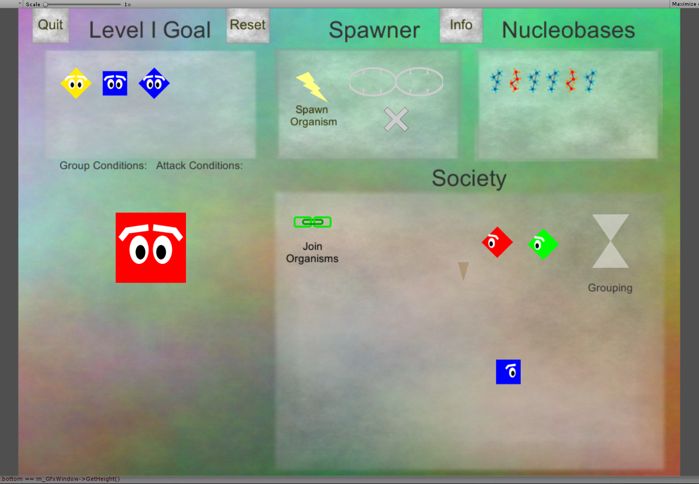

# Progeny Recombinant: An adventure in gene manipulation
## GitHub Game Off 2016

## The Premise

You are an almost all-powerful being. You can change the very fabric of your experiments,
and yet you refuse to meddle in their puny societal practices. Your star trekian methodology
lands you in a tough spot, because you are on assignment to alter the future of organisms 
strewn across the galaxy. Nonetheless, you take on this challenge confident in your skills.

## The Gameplay

You find yourself coming across societies of organisms that have their own unique ways of 
grouping together and attacking one another. You must learn these social practices and use 
them, along with your ability to change the very nature of each organism, their shape, their
color, in order to achieve a certain state of the society.

What you can do:

* Introduce new organisms into the society tailored to your specifications
* Join organisms in the society and mangle their genes, changing them wildly

What you can't do:

* Prevent organisms from mauling each other to bits and pieces. Be careful.

## How to Build / Play

This game is built in Unity, version 5.4.0. Any version greater than or equal to this should 
work fine. To build the project, create an empty project in Unity, copy the Assets and 
Project Settings folder into this project. Then go to File > Build & Run. Choose your platform
and then click Build, or Build and Run. 

In case this process is too frustrating, you can just download the built version in this repo.
This includes the progenyrecombinant.exe and progenyrecombinant_data directory. progenyrecombinant_data 
must be in the same directory as the executable in order for it to run.

Warning: This game is a complex puzzle game. Play the tutorial.

## Currently Implemented Features

Alot happens in the background as you alter an organism's traits. Currently, a society is implemented
as a set of organisms that is in a steady state, or is reaching one. 

A society stabilizes itself in 2 phases: Group phase and Attack phase.

The group phase involves reading in Group Conditions, objects that specify constraints on type and number of
organisms allowed in a group of certain trait values, and splitting the organisms in the society into 
as large groups as possible. Organisms that can't group with any other are left to roam the society for now.

The attack phase involves reading in Attack Conditions, objects that specify constraints on group types
that will attack each other. All organisms that are part of an attacking group then fight to the death.

As many Condition objects as you wish can be attached to a society, which is what gives the puzzles in this
game such potential to constantly provide new experiences for the player.

You as the player have two ways of interacting with the organisms. You can add organisms to the society one 
at a time, each trait defined by you as you fill each gene of the organism you create. Each gene holds two 
nucleobases, but this is not set in stone. The game can handle a variable number of nucleobase slots per gene,
a variable number of genes per organism, and a variable number of different types of nucleobases.

You can also join two organisms in the society and swap the nucleobases in their genes around. Once this is done,
the society will restabilize itself. You will be surprised how much you can do with these two simple actions.

A narrator guides you through parts of the game and is built to detect different events that occur in a level, 
responding to each one uniquely and with helpful remarks.

## Future Goals

The game's user interface is set for 1 society for each level, but the game's framework can handle several societies being altered at once. This means that, in the future, I can allow a player to add organisms to one of many societies 
and even swap organisms between societies. This will allow for a whole new branch of puzzles.

The game currently allows for as many gene types as you want that alter different properties of the organism. I 
have setup maps for Shape and Color alteration, but the framework has room for other trait alterations, such as Size of 
the organism, should I want to add them. The group and attack conditions can then take into account these new traits
as they are already variable in nature.

## Enjoy! And here are some screenshots:

